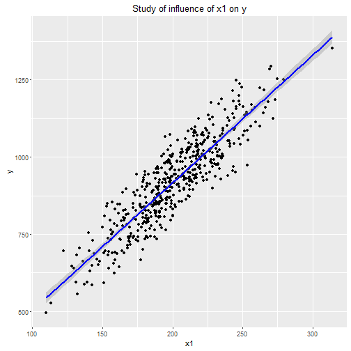

## Presentation of the project

The data come from the file company_data.csv, which gathers company data on 4 variables : x1, x2, x3 and y.
The goal of this project is to study the relationship between an outcome y and a predictor x1, to see the influence of this single varaible on the prediction of y. 

### Data load

```r
CompanyDF <- read.csv("company_data.csv",header=TRUE)
dim(CompanyDF)
```

```
## [1] 500   4
```

```r
names(CompanyDF)
```

```
## [1] "y"  "x1" "x2" "x3"
```

### Study of relationships between variables
In this section, we will plot the data and check the availability of the linear model. 


```r
library(ggplot2)
g <- ggplot(CompanyDF, aes(x=x1,y=y)) + geom_point() + ggtitle("Study of influence of x1 on y")
g <- g + geom_smooth(method = "lm", colour = "blue")
g
```



Here we define a linear model between y and x1.

```r
fit <- lm(y~x1,CompanyDF)
summary(fit)
```

```
## 
## Call:
## lm(formula = y ~ x1, data = CompanyDF)
## 
## Residuals:
##      Min       1Q   Median       3Q      Max 
## -164.572  -48.630   -1.861   49.181  170.498 
## 
## Coefficients:
##             Estimate Std. Error t value Pr(>|t|)    
## (Intercept) 90.77375   19.33019   4.696 3.44e-06 ***
## x1           4.13185    0.09524  43.383  < 2e-16 ***
## ---
## Signif. codes:  0 '***' 0.001 '**' 0.01 '*' 0.05 '.' 0.1 ' ' 1
## 
## Residual standard error: 64.59 on 498 degrees of freedom
## Multiple R-squared:  0.7908,	Adjusted R-squared:  0.7903 
## F-statistic:  1882 on 1 and 498 DF,  p-value: < 2.2e-16
```

We can see that the values of the outcomes y are mainly grouped along the regression line ${y=\beta_0+\beta_1*x_1}$. Furthermore, the value of ${R^2}$ is nearly 80%. This value is the ratio of the total  variation explaned by the model. This model shows that ${x_1}$ can explain most of the values of ${y}$. So we can say to the president of the company that there is a meaningful relationship between ${x_1}$ and  ${y}$.

### Value of the estimated coefficient between ${x_1}$ and ${y}$

We just need to take the value of the column ***Estimate*** on the line defining ${x_1}$ : 


```r
coefs <- summary(fit)$coefficients
coefs[2,1]
```

```
## [1] 4.131854
```


### 95% Confidence interval for slope ${\beta_1}$
By definition, the 95% confidence interval is built on the value of the estimate and the standard error of the slope. 

```r
IC_beta1 <- coefs[2,1]+qt(0.975,fit$df-2)*c(-1,1)*coefs[2,2]
IC_beta1
```

```
## [1] 3.944726 4.318983
```

```r
coefs[2,4]
```

```
## [1] 2.781114e-171
```

### p-Value for ${\beta_1}$
The p-Value is given by the fourth column of the coefs table :

```r
coefs[2,4]
```

```
## [1] 2.781114e-171
```
