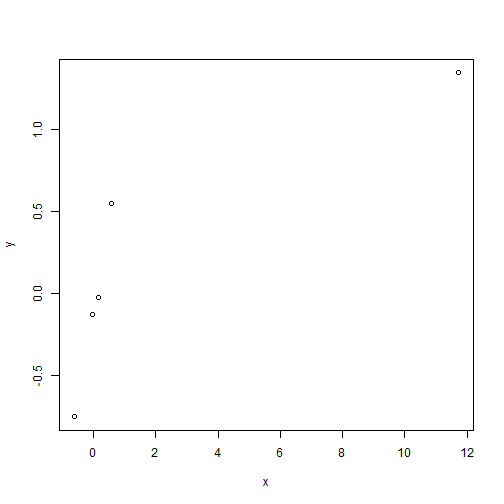

## Question 1 

Consider the mtcars data set. Fit a model with mpg as the outcome that includes number of cylinders as a factor variable and weight as confounder. Give the adjusted estimate for the expected change in mpg comparing 8 cylinders to 4.


```r
fit <- lm(mpg~factor(cyl)+wt,mtcars)
summary(fit)
```

```
## 
## Call:
## lm(formula = mpg ~ factor(cyl) + wt, data = mtcars)
## 
## Residuals:
##     Min      1Q  Median      3Q     Max 
## -4.5890 -1.2357 -0.5159  1.3845  5.7915 
## 
## Coefficients:
##              Estimate Std. Error t value Pr(>|t|)    
## (Intercept)   33.9908     1.8878  18.006  < 2e-16 ***
## factor(cyl)6  -4.2556     1.3861  -3.070 0.004718 ** 
## factor(cyl)8  -6.0709     1.6523  -3.674 0.000999 ***
## wt            -3.2056     0.7539  -4.252 0.000213 ***
## ---
## Signif. codes:  0 '***' 0.001 '**' 0.01 '*' 0.05 '.' 0.1 ' ' 1
## 
## Residual standard error: 2.557 on 28 degrees of freedom
## Multiple R-squared:  0.8374,	Adjusted R-squared:   0.82 
## F-statistic: 48.08 on 3 and 28 DF,  p-value: 3.594e-11
```

```r
fit$coefficients[3]
```

```
## factor(cyl)8 
##     -6.07086
```

## Question 2

Consider the mtcars data set. Fit a model with mpg as the outcome that includes number of cylinders as a factor variable and weight as a possible confounding variable. Compare the effect of 8 versus 4 cylinders on mpg for the adjusted and unadjusted by weight models. Here, adjusted means including the weight variable as a term in the regression model and unadjusted means the model without weight included. What can be said about the effect comparing 8 and 4 cylinders after looking at models with and without weight included?.


```r
fit1 <- lm(mpg~factor(cyl),mtcars)
fit1$coefficients[3]
```

```
## factor(cyl)8 
##    -11.56364
```
-11.564 < 6.071. So Holding weight constant, cylinder appears to have less of an impact on mpg than if weight is disregarded. 

## Question 3
Consider the mtcars data set. Fit a model with mpg as the outcome that considers number of cylinders as a factor variable and weight as confounder. Now fit a second model with mpg as the outcome model that considers the interaction between number of cylinders (as a factor variable) and weight. Give the P-value for the likelihood ratio test comparing the two models and suggest a model using 0.05 as a type I error rate significance benchmark.


```r
fit2 <- lm(mpg~factor(cyl)*wt,mtcars)
anova(fit,fit2)
```

```
## Analysis of Variance Table
## 
## Model 1: mpg ~ factor(cyl) + wt
## Model 2: mpg ~ factor(cyl) * wt
##   Res.Df    RSS Df Sum of Sq      F Pr(>F)
## 1     28 183.06                           
## 2     26 155.89  2     27.17 2.2658 0.1239
```
The P-value is larger than 0.05. So, according to our criterion, we would fail to reject, which suggests that the interaction terms may not be necessary.

## Question 4
Consider the mtcars data set. Fit a model with mpg as the outcome that includes number of cylinders as a factor variable and weight inlcuded in the model as


```r
fit3 <- lm(mpg~I(wt * 0.5) + factor(cyl), data = mtcars)
```
How is the wt coefficient interpretted?

Ans : As the reference unit for wt is 1000 lbs (i.e. a half-ton), the wt coef is interpreted as ***The estimated expected change in MPG per one ton increase in weight for a specific number of cylinders (4, 6, 8).***

## Question 5
Consider the following data set


```r
x <- c(0.586, 0.166, -0.042, -0.614, 11.72)
y <- c(0.549, -0.026, -0.127, -0.751, 1.344)
```
Give the hat diagonal for the most influential point


```r
plot(x,y)
```



```r
fit4 <- lm(y~x)
hatvalues(fit4)
```

```
##         1         2         3         4         5 
## 0.2286650 0.2438146 0.2525027 0.2804443 0.9945734
```
We can see that the most influential point is the last one (11.72,1.344).
As we can seen the corresponding hatvalue is 0.9946.

## Question 6

Consider the following data set


```r
x <- c(0.586, 0.166, -0.042, -0.614, 11.72)
y <- c(0.549, -0.026, -0.127, -0.751, 1.344)
```


```r
plot(x,y)
```


```r
fit5 <- lm(y~x)
hatvalues(fit5)
```

```
##         1         2         3         4         5 
## 0.2286650 0.2438146 0.2525027 0.2804443 0.9945734
```

```r
which(hatvalues(fit5)==max(hatvalues(fit5)))
```

```
## 5 
## 5
```

```r
dfbetas(fit5)[which(hatvalues(fit5)==max(hatvalues(fit5))),2]
```

```
## [1] -133.8226
```

## Question 7 

Consider a regression relationship between Y and X with and without adjustment for a third variable Z. Which of the following is true about comparing the regression coefficient between Y and X with and without adjustment for Z.

Solution:

It is possible for the coefficient to reverse sign after adjustment. For example, it can be strongly significant and positive before adjustment and strongly significant and negative after adjustment.
