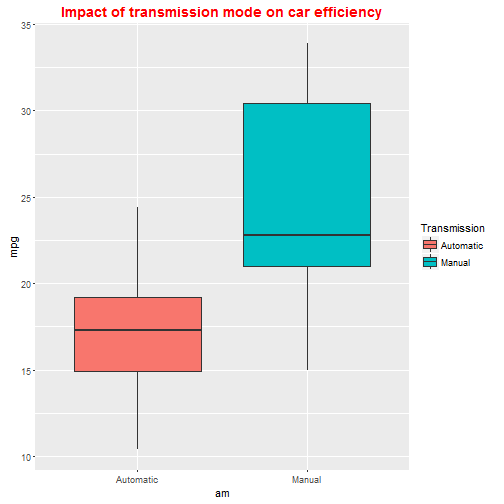
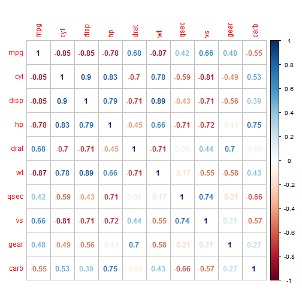
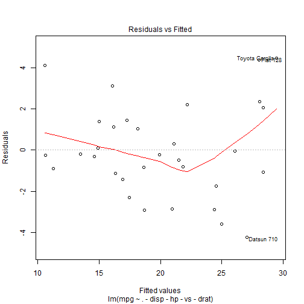
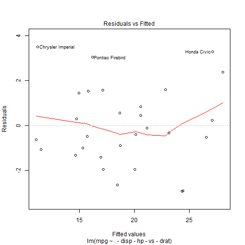

## Executive summary

The goal of this project is to study the influence of variables from the mtcars dataset. More precisely, we want to know how the mpg is related to other variables, in particular the 'am' variable, which defines if the vehicle has an automatic or manual transmission.
Beyond that, it will be also  interesting to know if other predictors can explain the outcome mpg. The goal is not to build the perfect model, but to explain as good a possible, the interaction between the predictors and the outcome. 

## Analysis of data
### Raw analysis
As a first step, we will draw a boxplot representing the significant values for each am. 

```r
library(ggplot2)
mtcars$am <- as.factor(mtcars$am)
g <- ggplot(mtcars, aes(x=am, y=mpg,fill=am)) + geom_boxplot()
g <- g + ggtitle("Impact of transmission mode on car efficiency")
g <- g + scale_x_discrete(labels=c("Automatic","Manual"))
g <- g + scale_fill_discrete(name="Transmission",labels=c("Automatic", "Manual"))
g<- g + theme(plot.title = element_text(color="red", size=14, face="bold"))
g
```



This boxplot shows obviously that the mode of transmission has a great influence on the car consumption. Automatic transmission gives higher values of mpg than manual transmission. 
To be more precise, the two following lines give the summary values for each category of transmission (0 = automatic, 1 = manual). 
We can also verify that the position of the means is very different for the automatic transmission and the manual transmission :
 
 * ***for automatic transmission*** : the median is about at the middle of the box,i.e. the observations of mpg are dispatched symetrically around this value
 
 * ***for manual transmission*** : the median is low in the box, i.e. there is a large dispersion of the high values of mpg. 

```r
summary(mtcars[mtcars$am==0,1])
```

```
##    Min. 1st Qu.  Median    Mean 3rd Qu.    Max. 
##   10.40   14.95   17.30   17.15   19.20   24.40
```

```r
summary(mtcars[mtcars$am==1,1])
```

```
##    Min. 1st Qu.  Median    Mean 3rd Qu.    Max. 
##   15.00   21.00   22.80   24.39   30.40   33.90
```

### First linear model : mpg vs am 

Here we try to build a linear model between the outcome mpg and the predictor am. 

```r
fit1 <- lm(mpg~factor(am),data=mtcars)
summary(fit1)
```

```
## 
## Call:
## lm(formula = mpg ~ factor(am), data = mtcars)
## 
## Residuals:
##     Min      1Q  Median      3Q     Max 
## -9.3923 -3.0923 -0.2974  3.2439  9.5077 
## 
## Coefficients:
##             Estimate Std. Error t value Pr(>|t|)    
## (Intercept)   17.147      1.125  15.247 1.13e-15 ***
## factor(am)1    7.245      1.764   4.106 0.000285 ***
## ---
## Signif. codes:  0 '***' 0.001 '**' 0.01 '*' 0.05 '.' 0.1 ' ' 1
## 
## Residual standard error: 4.902 on 30 degrees of freedom
## Multiple R-squared:  0.3598,	Adjusted R-squared:  0.3385 
## F-statistic: 16.86 on 1 and 30 DF,  p-value: 0.000285
```

As we can see, the adjusted ${R^2}$ is around 0.338. That means that this first model can only explain 33.8% of the data. So there may be other variables which could give a better understanding of the outcome.
We know that adding more variables increases the ${R^2}$ coefficient. So we expect a higher value of this coefficient by adding more predictors into the model.

### Second linear model : mpg vs all other predictors

In this section, we will include all the variables (except mpg) to explain mpg. This will give us a first approach of the robustness of this model including all the predictors. 


```r
library(car)
```

```
## Warning: package 'car' was built under R version 3.3.2
```

```r
library(corrplot)
```

```
## Warning: package 'corrplot' was built under R version 3.3.2
```

```r
fit2 <- lm(mpg~.,data=mtcars)
summary(fit2)
```

```
## 
## Call:
## lm(formula = mpg ~ ., data = mtcars)
## 
## Residuals:
##     Min      1Q  Median      3Q     Max 
## -3.4506 -1.6044 -0.1196  1.2193  4.6271 
## 
## Coefficients:
##             Estimate Std. Error t value Pr(>|t|)  
## (Intercept) 12.30337   18.71788   0.657   0.5181  
## cyl         -0.11144    1.04502  -0.107   0.9161  
## disp         0.01334    0.01786   0.747   0.4635  
## hp          -0.02148    0.02177  -0.987   0.3350  
## drat         0.78711    1.63537   0.481   0.6353  
## wt          -3.71530    1.89441  -1.961   0.0633 .
## qsec         0.82104    0.73084   1.123   0.2739  
## vs           0.31776    2.10451   0.151   0.8814  
## am1          2.52023    2.05665   1.225   0.2340  
## gear         0.65541    1.49326   0.439   0.6652  
## carb        -0.19942    0.82875  -0.241   0.8122  
## ---
## Signif. codes:  0 '***' 0.001 '**' 0.01 '*' 0.05 '.' 0.1 ' ' 1
## 
## Residual standard error: 2.65 on 21 degrees of freedom
## Multiple R-squared:  0.869,	Adjusted R-squared:  0.8066 
## F-statistic: 13.93 on 10 and 21 DF,  p-value: 3.793e-07
```

```r
vif(fit2)
```

```
##       cyl      disp        hp      drat        wt      qsec        vs 
## 15.373833 21.620241  9.832037  3.374620 15.164887  7.527958  4.965873 
##        am      gear      carb 
##  4.648487  5.357452  7.908747
```

As we can see, the adjusted ${R^2}$ is much higher (around 81%). This gives us the proof that other variables have an impact on the outcome mpg. But some may not be absolutely necessary. We will detect this in the following section by studing the ***multicolinearity***. 

## Study of the multicolinearity of the variables
To check how the variables are interdependant, we use the ***correlation matrix***. 


```r
mtcarsCorrMatrix <- cor(mtcars[sapply(mtcars,is.numeric)])
corrplot(mtcarsCorrMatrix,method="number")
```



The correlation matrix shows us the dependancies between the dataset variables. We can see in particular that *disp*, *vs* and *hp*  are highly dependent on other variables. We will try to remove them from the model and see the impact. 


```r
fit3 <- lm(mpg~. - disp-hp-vs,data=mtcars)
summary(fit3)
```

```
## 
## Call:
## lm(formula = mpg ~ . - disp - hp - vs, data = mtcars)
## 
## Residuals:
##     Min      1Q  Median      3Q     Max 
## -4.0140 -1.0985 -0.2574  1.3572  4.3389 
## 
## Coefficients:
##             Estimate Std. Error t value Pr(>|t|)  
## (Intercept)  11.5557    17.8225   0.648   0.5229  
## cyl          -0.1519     0.8485  -0.179   0.8594  
## drat          0.9618     1.5564   0.618   0.5424  
## wt           -2.8571     1.0861  -2.631   0.0147 *
## qsec          0.7942     0.5940   1.337   0.1937  
## am1           2.4682     1.9276   1.281   0.2126  
## gear          0.5701     1.4056   0.406   0.6887  
## carb         -0.7368     0.5636  -1.307   0.2034  
## ---
## Signif. codes:  0 '***' 0.001 '**' 0.01 '*' 0.05 '.' 0.1 ' ' 1
## 
## Residual standard error: 2.541 on 24 degrees of freedom
## Multiple R-squared:  0.8624,	Adjusted R-squared:  0.8223 
## F-statistic: 21.49 on 7 and 24 DF,  p-value: 6.892e-09
```

The adjusted ${R^2}$ raises to 82.2%. So that means that our model is better than the previous ones, because a higher percentage of the dataset is explained by the predictive model. 
Let's continue the investigation and remove the variable *drat* from the model. 


```r
fit4 <- lm(mpg~. - disp-hp-vs-drat,data=mtcars)
summary(fit4)
```

```
## 
## Call:
## lm(formula = mpg ~ . - disp - hp - vs - drat, data = mtcars)
## 
## Residuals:
##     Min      1Q  Median      3Q     Max 
## -4.2148 -1.1992 -0.2412  1.4018  4.4595 
## 
## Coefficients:
##             Estimate Std. Error t value Pr(>|t|)  
## (Intercept)  16.2624    15.9126   1.022   0.3166  
## cyl          -0.3137     0.7971  -0.393   0.6973  
## wt           -2.9548     1.0611  -2.785   0.0101 *
## qsec          0.7695     0.5853   1.315   0.2005  
## am1           2.6522     1.8807   1.410   0.1708  
## gear          0.6415     1.3835   0.464   0.6469  
## carb         -0.6764     0.5481  -1.234   0.2287  
## ---
## Signif. codes:  0 '***' 0.001 '**' 0.01 '*' 0.05 '.' 0.1 ' ' 1
## 
## Residual standard error: 2.509 on 25 degrees of freedom
## Multiple R-squared:  0.8602,	Adjusted R-squared:  0.8267 
## F-statistic: 25.64 on 6 and 25 DF,  p-value: 1.542e-09
```

The asjusted ${R^2}$ is a little bit higher than in the previous model (82.7% vs 82.2%). So we can estimate this model is quite good. Let's try a few more tests by removing other predictors. 


```r
fit5 <- lm(mpg~. - disp-hp-vs-carb-drat,data=mtcars)
summary(fit5)
```

```
## 
## Call:
## lm(formula = mpg ~ . - disp - hp - vs - carb - drat, data = mtcars)
## 
## Residuals:
##     Min      1Q  Median      3Q     Max 
## -3.7394 -1.3787 -0.8627  1.4275  4.6256 
## 
## Coefficients:
##             Estimate Std. Error t value Pr(>|t|)    
## (Intercept)  18.1752    15.9954   1.136 0.266206    
## cyl          -0.4643     0.7956  -0.584 0.564566    
## wt           -3.5917     0.9364  -3.836 0.000717 ***
## qsec          0.9349     0.5754   1.625 0.116261    
## am1           2.7317     1.8984   1.439 0.162097    
## gear         -0.3941     1.1108  -0.355 0.725602    
## ---
## Signif. codes:  0 '***' 0.001 '**' 0.01 '*' 0.05 '.' 0.1 ' ' 1
## 
## Residual standard error: 2.534 on 26 degrees of freedom
## Multiple R-squared:  0.8517,	Adjusted R-squared:  0.8232 
## F-statistic: 29.87 on 5 and 26 DF,  p-value: 5.429e-10
```


```r
fit6 <- lm(mpg~. - disp-hp-vs-carb-drat-qsec,data=mtcars)
summary(fit6)
```

```
## 
## Call:
## lm(formula = mpg ~ . - disp - hp - vs - carb - drat - qsec, data = mtcars)
## 
## Residuals:
##    Min     1Q Median     3Q    Max 
## -4.529 -1.491 -0.524  1.494  5.622 
## 
## Coefficients:
##             Estimate Std. Error t value Pr(>|t|)    
## (Intercept)  43.1678     4.5197   9.551 3.77e-10 ***
## cyl          -1.5688     0.4258  -3.684  0.00101 ** 
## wt           -3.0911     0.9108  -3.394  0.00214 ** 
## am1           1.3827     1.7583   0.786  0.43851    
## gear         -1.0812     1.0579  -1.022  0.31584    
## ---
## Signif. codes:  0 '***' 0.001 '**' 0.01 '*' 0.05 '.' 0.1 ' ' 1
## 
## Residual standard error: 2.61 on 27 degrees of freedom
## Multiple R-squared:  0.8367,	Adjusted R-squared:  0.8125 
## F-statistic: 34.57 on 4 and 27 DF,  p-value: 2.928e-10
```

The results from fit5 to fit6 show that the adjusted ${R^2}$ decreases. So we can estimate that these last three models are less precise than fit4, which appears to be the best one. 

### Analysis of residuals


```r
plot(fit4,which=1)
```



We can see from this graph that three points are far from the global repartition of data : Fiat 128, Toyota Corolla and Datsun 710. These points may be outliers. Let us see the results after removing these points.  

```r
fit4bis <- lm(mpg~. - disp-hp-vs-drat,data=mtcars[-c(3,18,20),])
summary(fit4bis)$adj.r.squared
```

```
## [1] 0.8493509
```

```r
plot(fit4bis,which=1)
```



The ajusted ${R^2}$ has been improved after this transformation. These points may be studied separately. 
