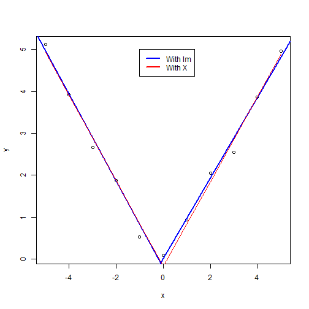

## Question 1

Consider the space shuttle data ?shuttle in the MASS library. Consider modeling the use of the autolander as the outcome (variable name use). Fit a logistic regression model with autolander (variable auto) use (labeled as "auto" 1) versus not (0) as predicted by wind sign (variable wind). Give the estimated odds ratio for autolander use comparing head winds, labeled as "head" in the variable headwind (numerator) to tail winds (denominator) :

* -0.031
* 1.327
* 0.969
* 0.031

### Data load

```r
library(MASS)
```

```
## Warning: package 'MASS' was built under R version 3.3.2
```

```r
library(dplyr)
```

```
## 
## Attaching package: 'dplyr'
```

```
## The following object is masked from 'package:MASS':
## 
##     select
```

```
## The following objects are masked from 'package:stats':
## 
##     filter, lag
```

```
## The following objects are masked from 'package:base':
## 
##     intersect, setdiff, setequal, union
```

```r
shuttle2 <- mutate(shuttle,auto=1*(use=="auto"))
View(shuttle)

logreg1 <- glm(auto~factor(wind)-1,family = binomial(link="logit"),data=shuttle2)
summary(logreg1)$coef
```

```
##                   Estimate Std. Error  z value  Pr(>|z|)
## factor(wind)head 0.2513144  0.1781742 1.410499 0.1583925
## factor(wind)tail 0.2831263  0.1785510 1.585689 0.1128099
```

```r
Coeffs <- summary(logreg1)$coef
LogoddRatioHeadTail <- Coeffs[1,1]-Coeffs[2,1]
oddRatioHeadTail <- exp(LogoddRatioHeadTail)
```

As we can see in the summary, the log of the odds ratio should be the difference between the estimate coefficient for head wind and the estimate coefficient for tail wind. So we need to exponentiate this value to get the odds ratio : 


```r
oddRatioHeadTail
```

```
## [1] 0.9686888
```

## Question 2

Consider the previous problem. Give the estimated odds ratio for autolander use comparing head winds (numerator) to tail winds (denominator) adjusting for wind strength from the variable magn.

* 1.00
* 0.969
* 1.485
* 0.684


```r
logreg2 <- glm(auto~factor(wind)+factor(magn)-1,family = binomial(link="logit"),data=shuttle2)
summary(logreg2)$coef
```

```
##                         Estimate Std. Error       z value  Pr(>|z|)
## factor(wind)head    3.635093e-01  0.2840608  1.279688e+00 0.2006547
## factor(wind)tail    3.955180e-01  0.2843987  1.390717e+00 0.1643114
## factor(magn)Medium -1.009525e-15  0.3599481 -2.804642e-15 1.0000000
## factor(magn)Out    -3.795136e-01  0.3567709 -1.063746e+00 0.2874438
## factor(magn)Strong -6.441258e-02  0.3589560 -1.794442e-01 0.8575889
```

```r
Coeffs <- summary(logreg2)$coef
LogoddRatioHeadTail <- Coeffs[1,1]-Coeffs[2,1]
oddRatioHeadTail <- exp(LogoddRatioHeadTail)
```


```r
oddRatioHeadTail
```

```
## [1] 0.9684981
```


## Question 3
If you fit a logistic regression model to a binary variable, for example use of the autolander, then fit a logistic regression model for one minus the outcome (not using the autolander) what happens to the coefficients?

* The coefficients get inverted (one over their previous value).
* The coefficients reverse their signs.
* The coefficients change in a non-linear fashion.
* The intercept changes sign, but the other coefficients don't.


```r
logreg3 <- glm(auto~factor(wind),family = binomial(link="logit"),data=shuttle2)
summary(logreg3)$coef
```

```
##                    Estimate Std. Error   z value  Pr(>|z|)
## (Intercept)      0.25131443  0.1781742 1.4104987 0.1583925
## factor(wind)tail 0.03181183  0.2522429 0.1261159 0.8996402
```

```r
logreg4 <- glm(1-auto~factor(wind),family = binomial(link="logit"),data=shuttle2)
summary(logreg4)$coef
```

```
##                     Estimate Std. Error    z value  Pr(>|z|)
## (Intercept)      -0.25131443  0.1781742 -1.4104987 0.1583925
## factor(wind)tail -0.03181183  0.2522429 -0.1261159 0.8996402
```

We can notice that the coefficients reverse their signs.

## Question 4
Consider the insect spray data InsectSprays. Fit a Poisson model using spray as a factor level. Report the estimated relative rate comapring spray A (numerator) to spray B (denominator).

* 0.136
* 0.321
* -0.056
* 0.9457


```r
poisreg4 <- glm(count~factor(spray)-1,family = poisson(link="log"),data=InsectSprays)
poisregcoefs <- summary(poisreg4)$coef
poisregcoefs
```

```
##                 Estimate Std. Error   z value      Pr(>|z|)
## factor(spray)A 2.6741486 0.07580980 35.274443 1.448048e-272
## factor(spray)B 2.7300291 0.07372098 37.031917 3.510670e-300
## factor(spray)C 0.7339692 0.19999987  3.669848  2.426946e-04
## factor(spray)D 1.5926308 0.13018891 12.233229  2.065604e-34
## factor(spray)E 1.2527630 0.15430335  8.118832  4.706917e-16
## factor(spray)F 2.8134107 0.07071068 39.787636  0.000000e+00
```

```r
rateSprayASprayB<- exp(poisregcoefs[1,1]-poisregcoefs[2,1])
rateSprayASprayB
```

```
## [1] 0.9456522
```

## Question 5
Consider a Poisson glm with an offset, t. So, for example, a model of the form glm(count ~ x + offset(t), family = poisson) where x is a factor variable comparing a treatment (1) to a control (0) and t is the natural log of a monitoring time. What is impact of the coefficient for x if we fit the model glm(count ~ x + offset(t2), family = poisson) where 2 <- log(10) + t? In other words, what happens to the coefficients if we change the units of the offset variable. (Note, adding log(10) on the log scale is multiplying by 10 on the original scale.)

Answer : no change on b1 coefficient.

## Question 6
Consider the data

x <- -5:5
y <- c(5.12, 3.93, 2.67, 1.87, 0.52, 0.08, 0.93, 2.05, 2.54, 3.87, 4.97)

Using a knot point at 0, fit a linear model that looks like a hockey stick with two lines meeting at x=0. Include an intercept term, x and the knot point term. What is the estimated slope of the line after 0?

* -0.183
* 1.013
* 2.037
*-1.024


```r
x <- -5:5
y <- c(5.12, 3.93, 2.67, 1.87, 0.52, 0.08, 0.93, 2.05, 2.54, 3.87, 4.97)
plot(x,y)
lm1 <- lm(y[1:6]~x[1:6])
lm2 <- lm(y[6:11]~x[6:11])

abline(lm1,col="blue",lw=2)
abline(lm2,col="blue",lw=2)
knot <- c(0)
splineterm <- sapply(knot,function(knot) ((x>knot)*(x-knot)))
mat <- cbind(1,x,splineterm)
linreg6 <- lm(y~mat-1)
pred6 <- predict(linreg6)
lines(x,pred6,col="red")
legend(x=-1,y=5, c("With lm","With X"),lty=c(1,1), lwd=c(2.5,2.5),col=c("blue", "red"))
```



```r
slope = (pred6[11]-pred6[6])/(x[11]-x[6])
slope
```

```
##       11 
## 1.013067
```
